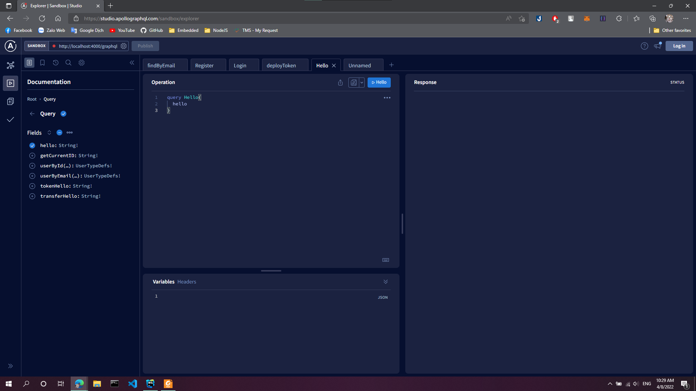
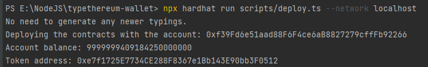

# I. Typethereum-wallet Project
## 1. Overview
This project demonstrates an advanced Hardhat use case, integrating other tools commonly used alongside Hardhat in the ecosystem.

The project comes with:
- A sample contract, 
- A test for that contract,
- A sample script that deploys that contract,
- A task implementation, which simply lists the available accounts.
- A transfer implementation, which sends ETH and tokens to an address

Try running some of the following tasks:

```shell
npx hardhat accounts
npx hardhat compile
npx hardhat clean
npx hardhat test
npx hardhat node
npx hardhat help
REPORT_GAS=true npx hardhat test
npx hardhat coverage
npx eslint '**/*.{js,ts}'
npx eslint '**/*.{js,ts}' --fix
npx prettier '**/*.{json,sol,md}' --check
npx prettier '**/*.{json,sol,md}' --write
npx solhint 'contracts/**/*.sol'
npx solhint 'contracts/**/*.sol' --fix
```

## 2. Etherscan verification

To try out Etherscan verification, you first need to deploy a contract to an Ethereum network that's supported by Etherscan, such as Ropsten.

In this project, copy the .env.example file to a file named .env, and then edit it to fill in the details. Enter your Etherscan API key, your Ropsten node URL (eg from Alchemy), and the private key of the account which will send the deployment transaction. With a valid .env file in place, first deploy your contract:

```shell
hardhat run --network ropsten scripts/deploy.ts
```

Then, copy the deployment address and paste it in to replace `DEPLOYED_CONTRACT_ADDRESS` in this command:

```shell
npx hardhat verify --network ropsten DEPLOYED_CONTRACT_ADDRESS "Hello, Hardhat!"
```

## 3. Performance optimizations

For faster runs of your tests and scripts, consider skipping ts-node's type checking by setting the environment variable `TS_NODE_TRANSPILE_ONLY` to `1` in hardhat's environment. For more details see [the documentation](https://hardhat.org/guides/typescript.html#performance-optimizations).


# II. Back-end API

## 1. Technologies used 
- MongoDB
- ExpressJS
- Hardhat CLI
- Typescript
- GraphQL
- JWT authentication
## 2. Running the project
First, in command shell, you need to start your Hardhat node by using:
```shell
npx hardhat node
```
Then, you need to start Apollo-graphql server by using command:
```shell
yarn start
```
or:
```
npm start
```
And open [http://localhost:4000/graphql](http://localhost:4000/graphql) in any browser. And you will see this:


Now, you can interact with the Hardhat node by sending query or mutation appeared on the tab Documentation.

# III. Problems and issues

This project still has problem when deploying tokens:
Deploying tokens will restart the server and then the deployment process will stop.
However, we can still deploy the tokens by using command shell:
```shell
npx hardhat run scripts/deploy.ts --network localhost
```


And I've not completed storing transactions into database
